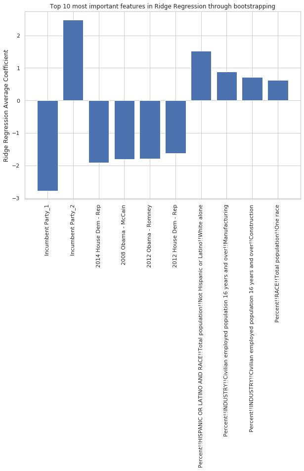
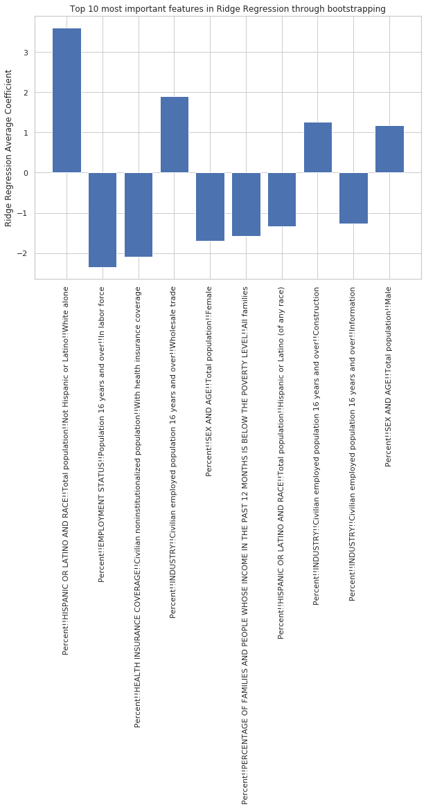
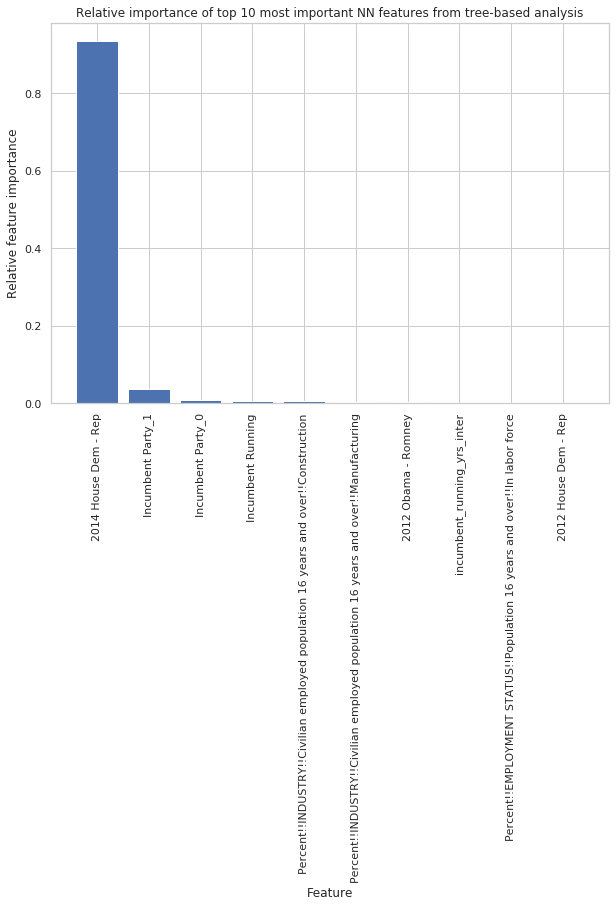
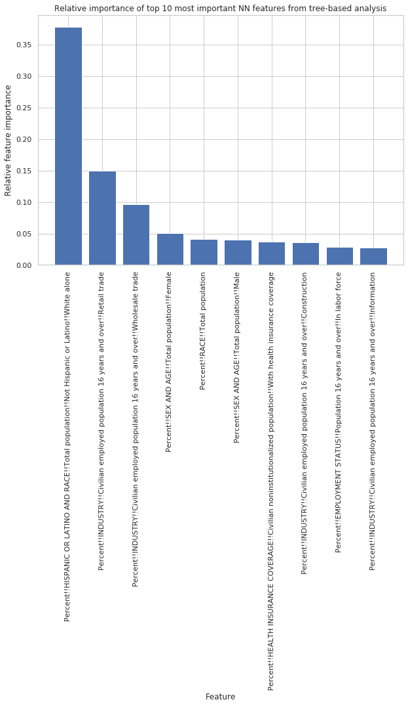
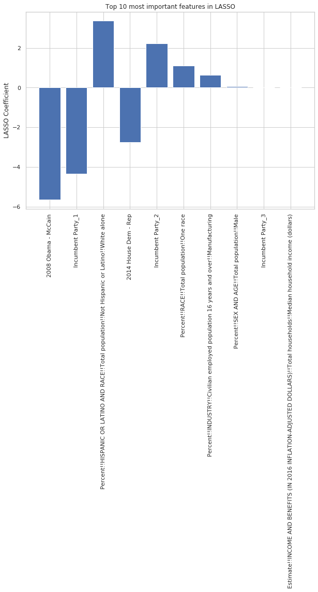
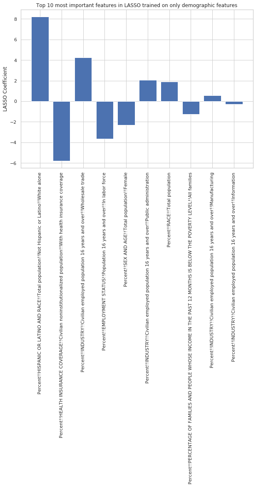

 
## Objective
 
1)	To determine which features (of all features tested) in the election districts led to the biggest swings in the results from 2016 midterm election.
2)	To determine which demographic features in the election districts are most important for the 2016 midterm election results for the demographic-only models.
 
## Methods
 
### Ridge Regression
 
For feature importance analysis in Ridge Regression, we used bootstrapping in order to get a distribution of values for each coefficient corresponding to each feature. Then, we used these bootstrapped coefficients to create a confidence interval for the true value of this coefficient. We reported the final top 10 predictors most important to the final prediction in the full feature set in Figure 12a, determining importance by the mean coefficient value for the values. The final top 10 predictors in the demographic-only Ridge Regression model is shown in Figure 13a. A variable that has a positive coefficient denotes an important contributor specifically for an elected Republican for that district, and a negative coefficient denotes an important contributor for an elected Democrat.

 
 
  
 
### Neural Network
 
For the feature importance determination in the Neural Network model, we fit the full training set on the multilayer perceptron architecture described in the Model Fitting and Comparison section. We used the predicted values for the output of the Neural Network as the target variable in a decision tree, and we use the same features as input to the decision tree. Then, we look at which variables were the most important in the decision tree to predict the output of the Neural Network, which described which variables were most important to the Neural Network’s output. The results on the full feature set model are shown in Figure 12b, and the results on the demographic-only feature set model are shown in Figure 13b. All values are positive, because the decision tree reports the relative importance of each feature.

 
 
  
 
### LASSO
 
For feature importance analysis in LASSO, we fit the model on the full training set. Because LASSO performs a type of feature selection by forcing non-important predictors to 0, we directly looked at the coefficients of the variables to determine feature importance. The results of the most important features in the full feature set are shown in Figure 12c, and the demographic-only LASSO model results are shown in Figure 13c. A variable that has a positive coefficient denotes an important contributor specifically for an elected Republican for that district, and a negative coefficient denotes an important contributor for an elected Democrat.

 
  

### Random Forest

For the feature importance in the random forest, the top feature in each tree within the random forest is taken. This is done for all trees within the random forest, and the final reported top 10 features are reported in terms of the number of appearances as the top feature in the trees within the random forest.
 
## Results
 
The results of the feature importance for all four full feature set models are shown in Figure 12 (a, b, c, d). We see that the majority of the most important features are determined by previous election data across all three models. In specific, the most important previous election data include the party of the incumbent, the voting differential in the U.S. House of Representatives, and the voting differential in the U.S. Presidential Election (see section about Exploratory Data Analysis for a discussion about why we included variables that we have seen that are highly correlated, even though this may skew our feature selection analysis). We see that among the demographic variables within this analysis, we see that the percentage of the district that is white and the proportion of the district’s industry that is within manufacturing both appear among the most important features at least two of the different models. Other important features that show up in one of the models’ feature analysis include percent of the population that is Latino or Hispanic, the proportion of the industry in information services, percent of industry in arts and entertainment, percent of families that are below the poverty line, and the proportion of the industry that is in the construction business.

 
 
The demographic-only feature importance results are shown in Figure 13 (a, b, c, d). We see that the most important racial variable is the percent of the district population that is White. In terms of race, we also see that the percent that is Hispanic and Latino is among the top 10 features of select models as well. Another feature that tops the most important features in a number of models is the percent of the population within the labor force. We see a variety of other features that are important in terms of the industry that the district is involved in, including percent in retail trade or wholesale trade. Finally, we also notice that more features that are important include the gender balance of the district and the proportion of the population with health insurance.

 
