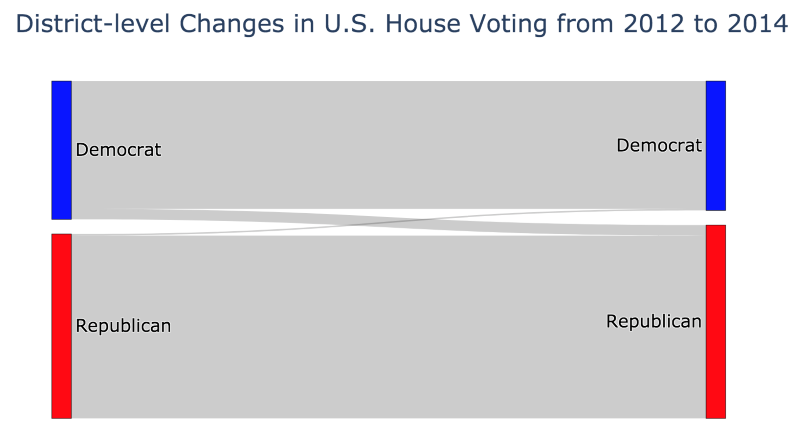

## Introduction:

For the demographic data, the ACS gives us both social and economic data of the relevant constituencies. For the previous election data, the Daily Kos has information for the winning party and categorical information about the incumbent such as if the race is open, if the incumbent won, if they lost, their name, religion, sex, race and party. 

## Data Scraping and Cleaning

The 5-Year estimates provide the most useful features, including percent breakdowns of race and economic class. However, the ACS will not release its estimates for 2018 until December 18th, 2019. As a result, we used their 2017 estimates as a proxy for the 2018 estimates. We downloaded the social and economic data from these web pages:

[2016 Demographic Data](https://data.census.gov/cedsci/table?q=&d=ACS%205-Year%20Estimates%20Data%20Profiles&table=DP02&tid=ACSDP5Y2016.DP02&y=2016&g=&lastDisplayedRow=0&vintage=2016&mode=)

[2017 Demographic Data](https://data.census.gov/cedsci/table?q=&d=ACS%205-Year%20Estimates%20Data%20Profiles&table=DP03&tid=ACSDP5Y2017.DP03&y=2017&g=&lastDisplayedRow=27&hidePreview=false&moe=false&vintage=2017&mode=)

We then drop all of the non-percent features except for median household income and mean household income from the economic features and voting age population and median age from the social features. This is to enable even comparison across districts. 

For the election results and incumbency data, we utilized these datasets from the Daily Kos:

[2016 Election Data](https://docs.google.com/spreadsheets/d/1GNRnHy677PD8Je6Rp3evaJ5ty5MbCIDIAkSJVJ3ax2c/edit#gid=1178631925)
[2018 Election Data](https://docs.google.com/spreadsheets/d/1oRl7vxEJUUDWJCyrjo62cELJD2ONIVl-D9TSUKiK9jk/edit#gid=1178631925)

Firstly, we drop all of the 2016 election features. This would limit the generalizability of our model as when we are predicting 2016 election results, 2016 election features will be overweighted, whereas they should not be when predicting the 2018 election results. Next we drop all of the constituency’s demographic features, as we built our own set for those from the ACS. Then, we replace the previous election with % Democrat - % Republican for both House and Presidential races. After that, we transform the incumbency features to features that are usable in modeling. This entails creating variables for whether incumbents are running, what party they are a part of and how long they’ve been in office and dropping the other variables about the incumbents. Finally, we merge the demographic and incumbency data to get our data sets. 

## Description of Data
 
As certain districts had been redistricted in 2012 and 2014, the previous election data for those districts was missing. As we had known the missing mechanism, i.e. whether or not the district had been redistricted, our data was missing at random and we use multivariate imputation for the missing values. This entails utilizing all of our other features to generate thousands of random of predictions for our missing values and then taking the averages of those predictions as our imputation. Following this we have three types of data.
	
Election data: These entail our outcome variable, i.e. which party won, whether an incumbent is running, how long the incumbent has been in office, the incumbent’s office and the percent difference of the previous House and Presidential elections. 

Social data: These entail the percent breakdowns of sex, age and race within each district in addition to voting age population and median voting age for each district. 

Economic data: These entail the percentage breakdowns of employment status, commuting status, occupation type, industry type, class of worker (private, public or self-employed), income strata, health insurance coverage and poverty level in addition to estimates for population in the labor force, working age population, median household income and mean household income. 

## Exploratory Data Analysis
 
### Overview
 
We perform exploratory data analysis to analyze which features are likely to give the best separation between our two outcomes (Republican or Democrat as the elected party in each district). We examine the relationship between features in order to identify which pairs of features may be useful, as well as show correlations between features that may influence our future modeling. This largely informed which demographic variables we would use in our analysis, and also prompted us to use the “demographic-only” models as the baseline models. We also create a “very simple” baseline based on our knowledge from EDA that previous election data is important as a predictive factor. Finally, we also learned that both demographic and previous election data are correlated with final party voted into the U.S. House of Representatives, which led us to the overarching question, “Can we use demographic and previous election data to accurately predict the district party results for the House, and ultimately, which party will have the majority in the U.S. House of Representatives?”.
 
### Detailed Methods and Results
 
#### Description of Feature Set
 
TODO (Chenevey)
 
#### Feature Histograms
 
We plot the two overlapping histograms for each of our features: one histogram for districts that ultimately elected a Democrat Representative, and one histogram for districts that ultimately elected a Republican Representative. The histograms show the total count of each value for each feature, which provides a gauge for whether or not any individual feature provides good separation between the final elected party in the districts.
 
Four notable histograms are shown in Figure 1. Figure 1a shows how the final elected party within the districts are related to the percentage of the population that is white within that district. We see a significant difference in shape and distribution between these two histograms. First, in any district that has a population with less than 10% of its population as white, the district always votes Democrat. We see that as the percentage of the district that is white increases, the proportion of districts that vote a Republican Representative into the U.S. House of Representatives increases. Once we get to districts that are above 90% white, the districts predominantly vote in a Republican Representative.

 
Figure 1b shows the relationship between the percentage of the district in the labor force separated by the elected party in the House of Representatives. We see that the Republican and Democrat histograms have a relatively similar shape, except for the fact that the Republican histogram shows a longer tail to the left, i.e. for districts that have a lower than 50% of the population in the labor force, they always vote in a Republican Representative. We also see that the Democrat histogram is slightly shifted to the right, so that districts that have a higher proportion of people in the labor force tend to vote Democrat into the House of Representatives.
 
 
 
Figure 1c shows the voting differential in the 2012 U.S. Presidential Election, calculated as % votes for Obama - % votes for Romney. We see that the 2016 midterm elections closely mirror the party affiliations for the 2012 U.S. Presidential Election, showing that this feature alone would be a high performing discriminator for our outcome variable of interest. However, there is still a significant degree of overlap between the two histograms, so there is room for improvement beyond just this feature alone.
 
  
 
Finally, Figure 1d shows the percentage of each district’s population that is in the retail industry. The histograms show that the Democrat histogram is slightly left shifted compared to the Republican histogram, with a higher proportion in this industry corresponding to a lower likelihood of voting Democrat in the 2016 U.S. House of Representatives election.

  
 
#### Pair Plot Analysis
 
In light of the four notable histograms described above, we conducted a pair plot analysis to identify any correlations or other multi-feature correspondence to our outcome variable between pairs of these four features. Figure 2 shows the results of the pair plot analysis for these four features, with the diagonal showing the kernel density estimate for each feature. One particularly interesting subplot is the plot that shows the 2012 Presidential Election voting differential on one axis and the proportion of population that is white on the other axis. We see a large degree of separation between the two parties, especially if a diagonal line is drawn on this plot. This boundary is mostly a product of the voting differential, but there is also some contribution of the proportion of white people within a district. We also see that any plot with the 2012 voting differential on an axis shows great separation from this variable alone, which is what we expect based on our histogram and kernel density estimate for this feature. All other feature pairs do not show a clearly defined separation boundary.

  
 
#### Analysis of Previous Election Data
 
We wanted to identify any correlations between previous election data included in the analysis. We use Sankey diagrams in order to illustrate the change in voting preferences for each district for (1) the 2008 U.S. Presidential Election to the 2012 U.S. Presidential Election and (2) the 2012 U.S. House of Representatives election to the 2014 U.S. House of Representatives election. The Sankey diagrams are shown in Figure 3. Figure 3a shows that from 2008 to 2012, the number of districts that converted from Republican to Democrat was very small (1 district), and the number of districts that converted from Democrat to Republican was slightly large (32 districts). The remaining districts all showed the same voting preference from the 2008 election to the 2012 election, showing a large degree of correlation in this variable. These general results make sense, because after one party remains in office for one term, there tends to be a swing in preference towards the other party. The 2012 election was conducted after Obama was in office for one term, following this trend. Figure 3b shows a similar pattern from the 2012 to the 2014 U.S. House of Representatives elections, where the number of districts who switched parties was even smaller (15 districts switched from Democrat to Republican, and 2 districts switched from Republican to Democrat).

 
 
 
Because of the large degree of correlation in these variables, including all of these variables within our final analysis could have a large implication for our feature analysis. For regression models, we know that regression will underestimate the coefficient of each of these features if they are highly correlated. Then, when we use the coefficient to estimate feature importance, the relative feature importance will not be accurate. A similar argument can be made for feature importance for the other non-regression models as well. However, because our focus for this assignment is on predictive modeling and accuracy, we have opted to include these features. We that these slight differences between the variables can be very important for our predictive modeling, especially because the districts that change party affiliations from election to election are likely the important “swing” districts that are harder to predict election results for. We thus would like to make clear in our feature analysis that when we find that the previous presidential election or House of Representatives results are important predictors, this likely implies that the highly correlated feature is also important to the predictive analysis. In addition, one of the main goals in feature analysis is the determine which demographic features are important in the predictive modeling (since we can already infer from Figure 1c above that previous election results are highly correlated with future election results), so our demographic-only models that do not include these features are unaffected by this correlation between variables.
