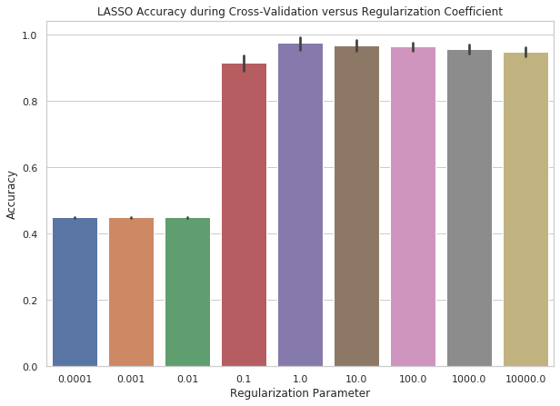
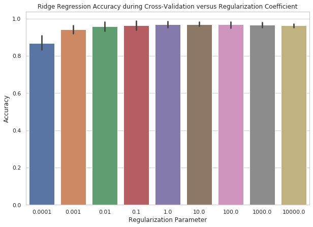
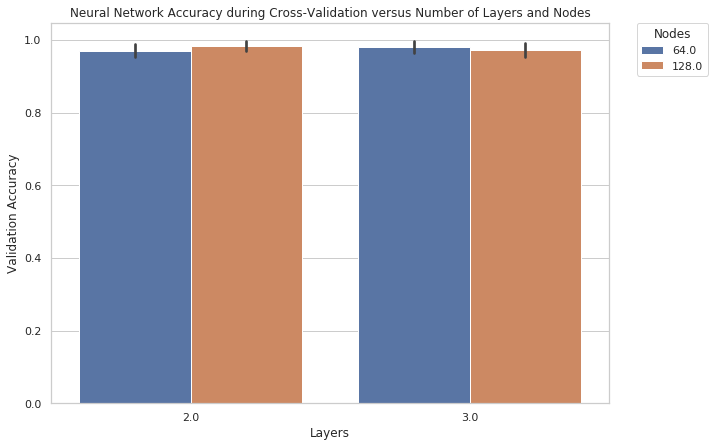
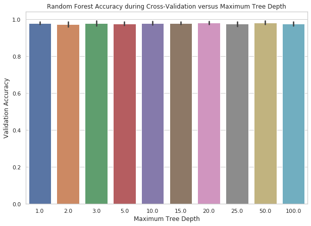
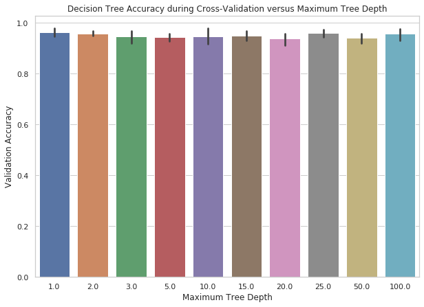
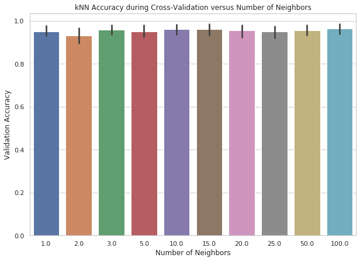
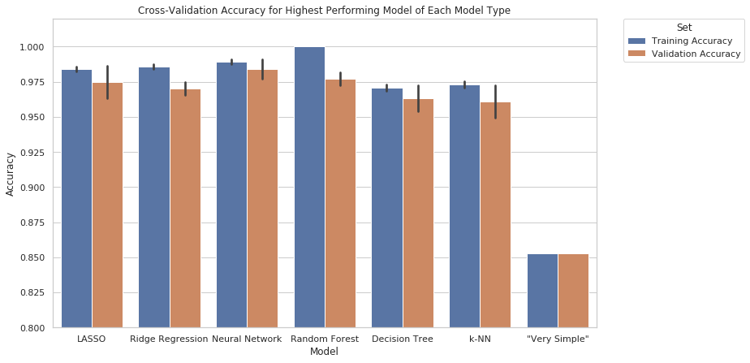

 
## Objectives
 
1)	We perform hyperparameter optimization for each of the six predictive models using cross-validation accuracy.
2)	We compare the parameter-optimized models of each of these types of models using average training and validation accuracies during cross-validation.
3)	Fit demographics-only models that use only the demographic features as inputs to see how the performance differs from the full set including the previous election data.
 
## Methods and Results (Model Parameter Tuning)
 
### Pre-processing
 
To get our dataset in a format compatible with our future model fitting, we have done a number of pre-processing steps for our data. For any features that are quantitative, we standardized the values by feature to be between 0 and 1. For any categorical features, the features are converted into dummy categories that correspond to each category of the categorical feature. The output label (the party that is elected in each district) were encoded in binary, where 0 corresponds to a Democrat elected, and 1 corresponds to a Republican elected.
 
### LASSO and Ridge Regression
 
For LASSO and Ridge Regression, the penalty parameter is fit by testing penalty terms on the log scale from 1e-4 to 1e4 and choosing the parameter that results in the highest average accuracy on the validation folds of cross-validation.
 
The results for LASSO are shown in Figure 4, and the results for Ridge Regression are shown in Figure 5. We see that the optimal regularization parameter for LASSO is 10, and for Ridge Regression it is 10. For LASSO, the performance of the model drops off significantly as the penalty term is decreased from 1, and the performance decreases slightly as the penalty term is increased from 1. For Ridge Regression, the performance across the regularization terms above 0.001 are relatively similar, but we choose a penalty term of 10 since it has the highest performance.
 
  
  
   
 
### Multilayer Perceptron
 
For fitting the multilayer perceptron, we tune two different hyperparameters: the number of nodes in each hidden layer and the number of hidden layers. The number of nodes that were tested were 64 and 128, whereas the number of hidden layers tested was 2 or 3. We show the performance of all four possible combinations of nodes and hidden layers in Figure 6. We see that the performance is very similar across all combinations, but the highest performing combination was 128 nodes and 2 hidden layers. We also did not test other combinations of hyperparameters, because in this small scale hyperparameter tuning, we saw that the performance was relatively unaffected by these hyperparameter adjustments. Because training a neural network for more combinations of hyperparameter tuning is computationally costly and the benefit did not seem to be great, we decided against further hyperparameter tuning.

 
 
### Random Forest and Decision Tree
 
For the random forest and decision tree models, we tuned the maximum tree depth parameter, ranging from 1 to 100. We used 100 different trees for the random forest and found that the performance of the random forest was consistent across all different depths tested (Figure 7). The highest performing random forest model had a maximum tree depth of 20, so we chose to use 20, even though there is evidence that many other options for the maximum tree depth would work well as well.

 
 
For the decision tree, we found that the maximum tree depth of 1 had the largest performance of the different values tested (Figure 8). However, the confidence bars in Figure 8 show that there is overlap between many of the different values of tree depth provided, so there may be another optimal value depending on the dataset. Our evidence points to a maximum tree depth of 1 being optimal, so we used this particular tree depth for downstream analyses of the decision tree model.

 
 
### k-NN
 
For the k-NN model, we tuned the number of nearest neighbors to determine how many neighboring observations to consider when making a prediction. We show that the highest performing model on average had 10 nearest neighbors, even though there was similar performance across the different parameters (Figure 9). We used a k-NN with 10 nearest neighbors for downstream analyses.

 
 
## Methods and Results (Baseline Model 1):

### “Very Simple” Model
 
We created a “very simple” model as a sanity check to ensure that our models are outperforming a very simple predictive approach. The predictive approach is as follows: first, find the results of the last 3 U.S. House of Representatives elections. Then, take the elected party in at least 2 of the 3 elections (a majority) as the predicted party to win the next election. We report the results of this model in the next section below, with the other model results. The baseline model performs at a performance of 85.3% accuracy on our entire 2016 U.S. House of Representatives dataset (Figure 10).

 

## Methods and Results (Baseline Models 2):
 
We also fit demographic-only models, which are the neural network, random forest, LASSO, and ridge regression trained only on the features that represent demographics. The previous election data features are left out of the feature set for this analysis. The purpose of this analysis was to (1) determine if we can accurately predict the election results solely based on demographic data and (2) use these models for feature analysis to determine which variables were most important in determining model predictions (described in the next section with the feature importance analysis). The same hyperparameters were used in the demographic-only models as in the full feature set models discussed above.
 
Figure 11 shows the demographic-only model performance (left) and the performance of the corresponding models including both demographics and previous election data (right). We see a larger amount of overfitting in all four demographic-only models, where the gap between the training and validation accuracy is higher compared to the full feature set models. The validation accuracy has gone down by over 10% for each of the models compared to the corresponding full feature set models. The highest performing demographic-model was ridge regression, which still showed a significant accuracy drop very high performance on the full feature set. The LASSO performs next best, then random forest, followed by the neural network. None of the demographic-only models outperform the “very simple” model that used only the previous election data.

## Methods and Results (Predictive Models Performance):
 
Figure 10 shows the cross-validation results across the best performing model for each type of model. We see that in terms of training accuracy, the random forest has near perfect accuracy, followed by Neural Network, Ridge Regression, and LASSO. However, we see that for all of the predictive models, excluding the “very simple” model, the training accuracy is higher than the validation accuracy, showing overfitting.
 
The validation accuracy is most important, since this best represents the accuracy on an independent set of data compared to the training accuracy. We see that in terms of validation accuracy, the highest performing model is the neural network (multilayer perceptron). The next highest performing model is the random forest, followed by LASSO, and finally ridge regression. It is important to note that these validation accuracies are all very close and within the error bars, so there is no strong evidence that one is better than the other. We see that there is a drop in average validation accuracy to the decision tree, then the k-NN. The “very simple” model underperforms compared to the other models significantly, having an accuracy of 10% worse compared to the next lowest performing model.
 
Because the neural network (multilayer perceptron) had the highest average accuracy on the validation folds within cross-validation, we will choose the neural network model as our chosen model for the prediction of the 2018 U.S. House of Representatives midterm elections. We will also use the generally high performing models (neural network, random forest, LASSO, and ridge regression) for future analyses in the demographic-only models and feature selection analyses below.
