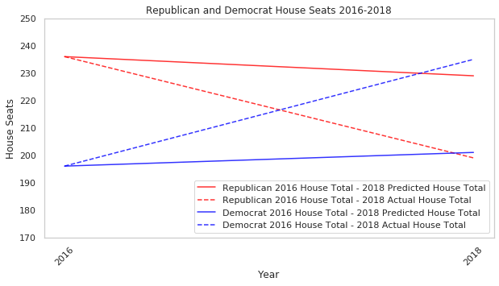

 
## Objective
 
The objective here is to use model selection and data methods from 2016 to predict the 2018 election outcome. 
 
## Methods and Results

### Selected Models

We selected the top-performing models found during testing and applied them to the test data. These models were LASSO, Ridge, Neural Network, and Random Forest.

### Results

The following models were trained using available 2016 data in two forms: with and without previous election data (see data exploration section for more info). The accuracies reported describe the models' efficacy on predicting 2018 outcomes.

| Model          | Accuracy on Full Test Data | Accuracy on Demographic Only Data |
|----------------|---------------------------:|----------------------------------:|
| LASSO          |                     90.93% |                            79.93% |
| Ridge          |                     91.16% |                            79.77% |
| Neural Network |                     91.63% |                            76.28% |
| Random Forest  |                     89.53% |                            82.79% |

## Interpretation

As seen in Figure 14, when utilizing our best model from the training set (i.e. the random forest), we predicted the Republican house total to drop by 7 from 236 to 229 representatives and the Democratic house total to go up by 5 from 196 to 201 with the difference going to independents or vacancy. Although the directionality and overwhelming majority of districts were predicted correctly, we undershot the swing as in actuality the Democrat total went up 39 to 235 and the Republican total dropped by 37 to 199. In hindsight, the other models would have provided a marginal improvement, but nothing to match the magnitude of the actual swing. 

The inclusion of the election features has an impact on our predictive accuracy across all models, driving them from the ~76%-83% range to the ~89%-92% range. What's interesting here is how the random forest performs the best on the demographic only data, but the worst on the full test data. Regardless, FiveThirtyEight's best model had ~96% prediction accuracy for the 2018 house midterm elections, so we were not far off the industry standard. 
